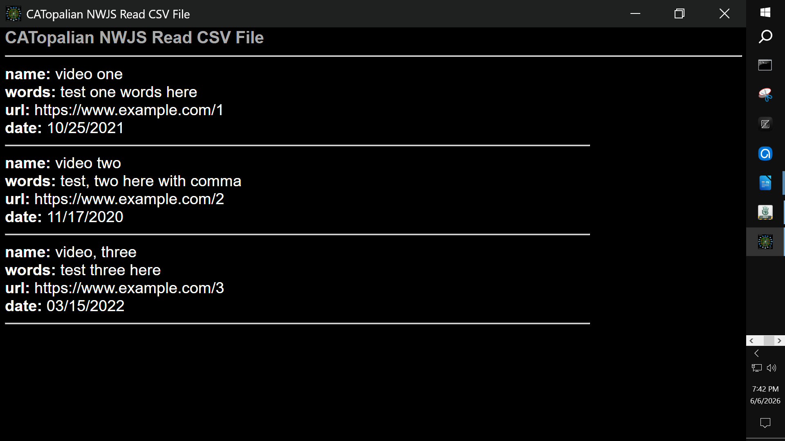

# CATopalian NWJS Read CSV File v002
v002 How to read a CSV File using Node.js and NW.js. Our method makes it possible to use commas in our CSV data!

---

Video: https://www.youtube.com/watch?v=f8hUqevJ0nA

---

> This is v002.
If you would like the most recent version go here: https://github.com/ChristopherAndrewTopalian/CATopalian_NWJS_Read_CSV_File

---

## **Dedicated to God the Father**

## Author

**Christopher Andrew Topalian**
© 2000-2026 All Rights Reserved

- GitHub: [https://github.com/ChristopherAndrewTopalian](https://github.com/ChristopherAndrewTopalian)

- GitHub: [https://github.com/ChristopherTopalian](https://github.com/ChristopherTopalian)
- College of Scripting Music & Science: [https://sites.google.com/view/CollegeOfScripting](https://sites.google.com/view/CollegeOfScripting)

